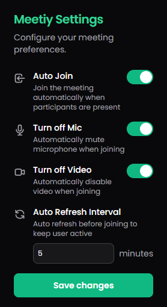

# Google Meet Auto-Join Extension

A Chrome extension that automatically joins Google Meet sessions and manages your camera/microphone settings.

## Preview

## Features

- 🤖 Automatically joins Google Meet sessions when participants are present
- 🎥 Option to automatically turn off camera before joining
- 🎤 Option to automatically turn off microphone before joining
- 🔄 Auto-refresh capability when no meeting is active
- ⚙️ Customizable refresh interval
- 💡 Supports both "Join now" and "Ask to join" meeting types

## Installation

1. Download or clone this repository
2. Open Chrome and navigate to `chrome://extensions/`
3. Enable "Developer mode" in the top right corner
4. Click "Load unpacked" and select the extension directory

## Usage

1. Click the extension icon in your Chrome toolbar to access settings
2. Configure your preferences:
   - Auto Join: Enable/disable automatic joining
   - Microphone Off: Automatically turn off microphone
   - Camera Off: Automatically turn off camera
   - Refresh Interval: Set how often the page should refresh while waiting for participants

## How It Works

The extension monitors Google Meet pages for:
- Presence of participants
- Join buttons ("Join now" or "Ask to join")
- Camera and microphone controls

When participants are detected and auto-join is enabled, the extension will:
1. Apply your camera/microphone preferences
2. Click the appropriate join button
3. Continue monitoring until you're successfully in the meeting

## Privacy & Permissions

This extension only runs on Google Meet pages (`meet.google.com`) and requires the following permissions:
- Storage: To save your preferences
- Host permissions for Google Meet: To interact with meeting controls

## Contributing

Feel free to submit issues, fork the repository, and create pull requests for any improvements.
